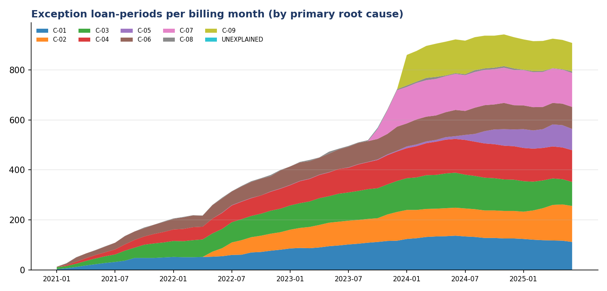
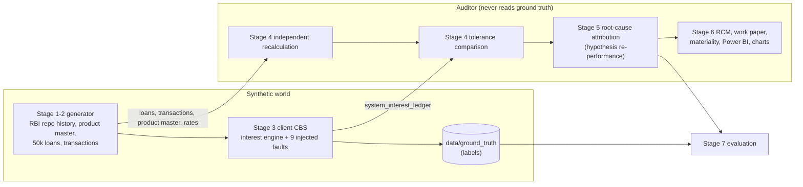

# ITAC Testing Engine for Loan Interest Computation

Full-population testing of the automated application controls (ITACs) that compute interest on a bank's loan book: an independent recalculation of every loan in every billing month, exception identification against a documented tolerance, root-cause attribution of each exception to a specific control, and the audit deliverables an engagement team would file (RCM, work paper, materiality, Power BI model).

All data is synthetic. A simulated core banking system (CBS) with nine deliberately injected configuration faults plays the client; an evaluation layer then scores the audit engine against the injected ground truth, which the audit engine never sees.

## Headline results (this run, fixed seeds)

| | |
|---|---|
| Population tested | 50,000 loans, 5 products, ₹11,063 Cr disbursed, **1,296,378 loan-periods** (Jan-2021 to Jun-2025), 1,229,578 transactions |
| Full-population recalculation | **0.8 s**; complete audit run (load, recalculate, compare, attribute) **7.2 s**; whole pipeline incl. data generation ~70 s |
| Exceptions | 27,458 loan-periods on 1,416 loans (2.83% of loans) |
| Detection vs injected faults | **precision 100.0%, recall 99.9%** at loan level; loan-period recall 96.7% vs any change, 100% vs changes above tolerance |
| Root-cause attribution | **99.8% exact match** (single-fault loans 100%, two-fault loans 93.3%); 1 loan left unexplained for manual follow-up |
| Misstatement found | ₹51.9 lakh net income overstatement (100.0% of injected net); gross error ₹1.20 Cr |
| FY2024-25 materiality | net misstatement ₹31.5 lakh vs overall materiality ₹4.23 Cr: **not material**, above clearly trivial (₹21.1 lakh) so recorded on the summary of audit differences |
| Control conclusions | all 9 controls **Deficient**; C-02, C-05, C-07 escalated as significant deficiencies on qualitative grounds |

Every miss is explained individually in [`outputs/evaluation_report.md`](outputs/evaluation_report.md), including one genuine weakness in the tolerance design (see *Limitations*).



The shape of that chart is itself audit evidence: C-02 (reset lag) appears with the May-2022 repo hiking cycle and again with the 2025 cuts, C-07 starts exactly at the 01-Oct-2023 product master change, C-05 starts at the July-2024 penal-charge regime switchover, and C-09 starts in 2024. C-09 persists into 2025 because the leap-year over-accrual is carried in the balance, so every later period's interest is also off.

## The audit problem

Interest income is the largest revenue line of a bank and it is produced almost entirely by the CBS. The controls over it are automated: the system picks up the rate from the product master, resets floating rates against the benchmark, accrues daily on the right day-count basis, rounds, handles moratoria, levies penal charges and stops accruing on closure. If any parameter is wrong, the error repeats on every affected account, every month, silently.

**The traditional approach is a test of one.** For each automated control the auditor picks one transaction, re-performs the computation, and relies on effective ITGCs (change management, access) to extend the conclusion to the whole population. That inference is only as good as two assumptions: that the ITGCs held for the whole period, and that the one item exercised the same configuration path as everything else. Neither holds for the faults injected here. A mis-set day-count parameter on a legacy batch of personal loans, or a product master change that was not propagated to pre-existing accounts, is invisible to a test of one unless the chosen item happens to sit in the affected slice.

**This engine recalculates the full population instead.** Every loan-period is recomputed from contract terms and compared with the CBS ledger, so every product, convention, reset, moratorium, penal and closure path is tested directly and every error is quantified in rupees. The C-07 result shows why this matters: it is an ITGC change-management failure that surfaces as an application-control exception, so the full-population test finds the ITGC gap rather than relying on it.

## Architecture



```
config/            products.yaml (product master), injection.yaml (client faults), audit.yaml, rcm.yaml
data/reference/    benchmark_rates.csv (RBI repo history + synthetic 1Y MCLR)
data/generated/    parquet + core_banking.sqlite (SQLAlchemy; set ITAC_DB_URL for PostgreSQL)
data/ground_truth/ injected labels - read ONLY by src/evaluation
src/common/        calendar, day-count, rounding, EMI, rate lookup (shared primitives)
src/generator/     stages 1-2
src/client_system/ stage 3 (the "client" CBS)
src/audit_engine/  stages 4-5 (population, recalc, compare, attribution)
src/reporting/     stage 6
src/evaluation/    stage 7
app/               Streamlit viewer
tests/             pytest, incl. the no-leakage test
```

**Independence of the recalculation.** The audit engine is a separate implementation of the documented business rules. It does not import `client_system`, reads the CBS ledger only as data, and never touches `data/ground_truth/`. `tests/test_no_leakage.py` enforces this three ways: it scans audit-engine source for ground-truth references, parses every import, and checks the runtime import graph. I confirmed the test fails when a forbidden import is planted.

**Performance design.** There are no per-loan-per-day rows. Each billing month is split into at most three segments at the dates where balance or rate changes (a reset and a part-prepayment). Interest is balance × rate × day fraction summed over the segments, vectorised across all live loans with NumPy, in a loop over the 54 months. 1.3 M loan-periods recalculate in under a second.

## Controls tested

| ID | Control | What the recalculation re-performs | Fault injected in the client CBS |
|---|---|---|---|
| C-01 | Rate application | benchmark + product spread + loan risk premium (floating) or card rate + premium (fixed) | wrong rate offset at set-up (+0.10/+0.25/+0.50/−0.25%) |
| C-02 | Reset timing | reset on each disbursal anniversary per reset frequency, benchmark in force *on* the reset date | reset applied one cycle late |
| C-03 | Day-count | product convention (ACT/365F, ACT/ACT) | 30E/360 on a legacy batch of PL-FIX |
| C-04 | Moratorium | simple interest to a non-interest-bearing bucket | monthly capitalisation (interest on interest) |
| C-05 | Penal charges | fixed fee per bounced instalment, non-interest-bearing, never capitalised | legacy behaviour after regime switchover: capitalised, or +2% penal interest |
| C-06 | Rounding | half-up to 2 dp once per billing period | daily rounding to the rupee |
| C-07 | Product master change (ITGC) | HL-FLT spread 2.75% → 2.50% from 01-Oct-2023, applied at each loan's next reset | pre-change spread kept on existing loans |
| C-08 | Accrual stop | accrual ends on the closure value date | accrual continues to period end |
| C-09 | Leap year | ACT/ACT uses 366 days in 2024 | 365-day basis in 2024 |

Loan-period exceptions are raised when `|system − recalculated| > max(₹1, 0.01% × recalculated)` for any of interest, penal charge, closing principal or closing balance.

## Root-cause attribution

An exception tells you something is wrong; the client needs to know *which control* failed. For every exception loan, the engine re-performs the calculation under each candidate configuration error and accepts a hypothesis only if it reproduces the CBS figures within tolerance **for every period and every metric** of that loan. If no single hypothesis fits, pairs are tried. Outcomes are *Attributed*, *Ambiguous* (more than one control fits, so the loan is reported but not assigned) or *Unexplained* (an open item).

The wrong-rate hypothesis (C-01) does not scan a grid of offsets, which would amount to guessing the injected values. The implied offset is solved from the data: the difference in the **first** differing period divided by the interest a 1% rate change would produce on that period's balances, rounded to 5 bps and then re-tested across the whole loan. The first period matters because opening balances still agree there; later periods are contaminated by the balance drift the error itself creates. Using the median across all periods (my first version) mis-estimated 77 loans.

## Deliverables

| File | Contents |
|---|---|
| `outputs/RCM.xlsx` | Risk and control matrix: risk, control, type, procedure, population, exceptions, rupee impact, conclusion, deficiency classification, recommendation |
| `outputs/workpaper_ITAC_interest.xlsx` | Work paper: Objective & Scope, Procedure Performed, Population & Completeness, Exceptions Detail (27,458 rows), Loan Attribution, Impact Allocation, Root Cause Summary, Materiality, Conclusion + sign-off. Summary tabs use live formulas (COUNTIFS/SUMIFS/IF); recalculated with zero formula errors |
| `outputs/materiality_summary.md` | FY2024-25 materiality and misstatement by control |
| `outputs/powerbi/` | Star schema (`fact_exceptions`, `fact_control_impact`, `dim_loan`, `dim_product`, `dim_control`, `dim_period`) + `DASHBOARD_SPEC.md` with relationships, DAX measures and page layouts |
| `outputs/charts/` | PNG charts used in this README |
| `outputs/audit/` | Engine outputs: expected ledger, exceptions, attribution, impact allocation, run log with timings and completeness |
| `outputs/evaluation_report.md/.json` | Precision/recall, confusion matrix, every miss explained, tolerance sensitivity, misstatement detected vs injected |

## Running it

```bash
pip install -r requirements.txt
python run_all.py                  # all stages; add --pause to stop at each checkpoint
python -m pytest -q tests          # 29 tests
streamlit run app/streamlit_app.py # browse RCM, filter exceptions, drill into a loan, view evaluation
```

`make all | test | app | clean` do the same. Python 3.11+, fixed seeds, so every number above is reproducible.

## Assumptions (business rules both sides follow)

- **Billing periods** are calendar months; the disbursal month is a broken period from the disbursal date. Instalments fall due and are paid on the last day of the month, so interest for the month accrues on the pre-payment balance.
- **Rate changes take effect on their effective date.** A reset on 08-Jun-2022 (an MPC date) picks up 4.90%. The benchmark *announcement* date is not the loan's reset date. Floating loans reset on disbursal anniversaries every 3 months (EBLR) or 12 months (MCLR), with day-of-month clipped to month end (31-Jan → 29-Feb). This is why a lagged reset (C-02) is realistic.
- **ACT/ACT is the ISDA variant:** days falling in each calendar year divided by that year's length (366 in 2024). The ICMA variant (period-based) would give different figures; the product master names ISDA.
- **30E/360** is the Eurobond basis (D1 and D2 capped at 30), used only as the C-03 fault.
- **Rounding:** interest is rounded half-up (not banker's rounding) to 2 dp once per period; EMIs are rounded half-up to the rupee.
- **EMI** uses the standard reducing-balance formula at rate/12. It is recalculated at each rate reset and after a part-prepayment, **keeping the remaining tenure unchanged**. Because accrual is on actual days, the final instalment settles the residual balance.
- **Balances:** principal bears interest; interest arrears and penal charges receivable do not (no compounding). Payments are applied penal charges → interest → principal.
- **Moratorium:** no instalments; interest accrues as simple interest into arrears and is recovered from later instalments.
- **Penal charges:** a fixed fee per bounced instalment per product (₹500–1,000). RBI's *Fair Lending Practice – Penal Charges in Loan Accounts* (DoR.MCS.REC.28/01.01.001/2023-24, 18-Aug-2023; timeline extended by DoR.MCS.REC.61/01.01.001/2023-24, 29-Dec-2023) applies to fresh loans from 01-Apr-2024, and existing loans switch over at the next review/renewal on or after that date, no later than 30-Jun-2024. I assume the bank used the backstop for all existing loans (regime from July 2024). The C-05 fault is modelled as legacy behaviour surviving the migration, so it is only injected, and only tested, in periods under the new regime.
- **Transaction amounts** (EMIs, payoff and prepayment quotes) were resolved once from correct contract terms and are shared facts. Where the CBS is faulty, its balances therefore do not close to exactly zero, which is realistic: the customer paid the contractual amount.
- **Benchmarks:** the RBI repo history (10 changes from 22-May-2020 to 06-Jun-2025, plus a 27-Mar-2020 context row) was verified against RBI press releases and MPC statements. The repo rate was later cut to 5.25% (Dec-2025), outside the observation window. **1Y MCLR is synthetic**: each bank sets its own, so it is modelled as `7.00 + 0.65 × (repo 90 days earlier − 4.00)`, rounded to 5 bps and reset monthly.
- **Materiality** is illustrative: 0.5% of the portfolio's FY2024-25 recalculated interest income, performance materiality at 75%, clearly trivial at 5%. In a real engagement it comes from the planning memo, usually PBT-based.

## Limitations (read before relying on the numbers)

- **Synthetic data is too clean.** Zero false positives will not survive a real CBS extract, which contains undocumented product features, manual adjustments, back-valued entries and extraction issues. The tolerance and an exception-triage step exist for those.
- **Shared primitives.** Auditor and client share `src/common` (day-count, rounding, EMI, rate lookup). A bug there would be invisible to the comparison, which is the same risk as an auditor reusing the client's own logic. Unit tests against hand-computed values reduce this risk but do not remove it.
- **The hypothesis library only knows the faults I thought of.** A novel fault shows up as Unexplained. That is the correct audit outcome, but it makes 99.8% attribution accuracy an upper bound.
- **A tolerance weakness the evaluation exposed.** One C-05 loan (a capitalised ₹750 penal charge on a ₹95.8 lakh home loan) was not flagged. Closing balance does not move when a charge is merely reclassified into principal, and the relative leg of the tolerance on principal (~₹958) exceeds ₹750. The right fix is an absolute-only tolerance on the penal-receivable component, because any capitalised penal charge is a regulatory breach. I have documented it rather than applied it, so the reported metrics are not tuned on ground truth.
- **Faults with no numeric effect are undetectable by recalculation.** 12 of 173 injected reset lags changed nothing, because the benchmark did not move between the two reset dates. Finding those needs configuration or parameter review (ITGC), not recalculation.
- **Simplified products.** There are no floors or caps, fees, subvention, restructuring, NPA interest reversal or income-recognition rules, and no partial payments within an instalment. Missed instalments are either caught up next month or settled at maturity.
- **The Streamlit app** was smoke-tested page by page against a stub in the build environment (Streamlit could not be installed there); run it locally to see it rendered.
